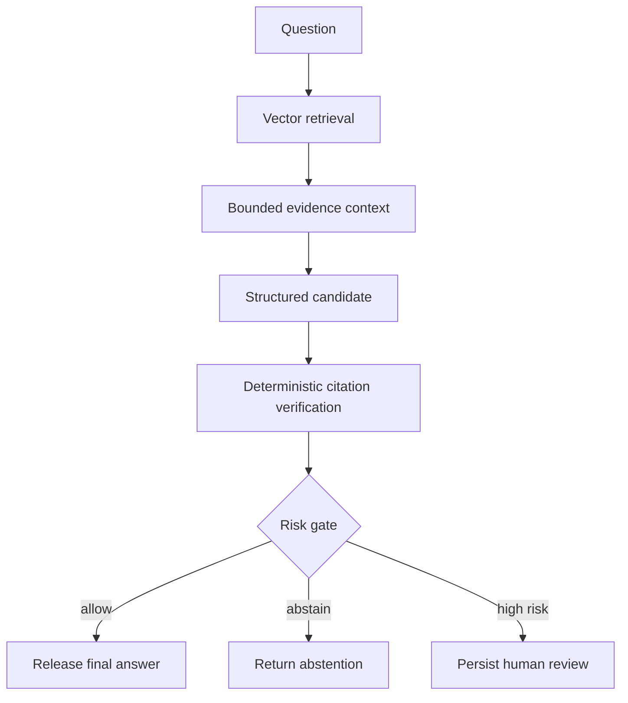

# Enterprise AI Risk & Document Intelligence

Production-oriented reference implementation for measurable retrieval, grounded generation, deterministic governance, and human review.

[](https://github.com/techthumb1/enterprise-genai-lab/actions/workflows/ci.yml)


## Why this project exists

This is not another chat-with-a-PDF demo. It is an engineering lab for the parts of enterprise GenAI systems that determine whether an answer can be trusted, reproduced, reviewed, and operated:

- deterministic ingestion with source provenance;
- immutable, versioned processing strategies;
- lexical, vector, and RRF-based hybrid retrieval;
- source-span-based retrieval evaluation;
- provider-independent structured generation;
- deterministic citation enforcement and explicit abstention;
- typed LangGraph orchestration;
- risk-based release and persisted human review;
- FastAPI, PostgreSQL/pgvector, migrations, and privacy-aware telemetry.

The governing principle is simple: **implement deterministic primitives first, measure them, and use LangGraph to orchestrate the validated components.**

## Current capabilities

| Layer | Implemented behavior |
| --- | --- |
| Ingestion | TXT, Markdown, and structured-text parsing; deterministic fixed-window chunking; SHA-256 identity; source spans; idempotent persistence |
| Versioning | One source document can retain multiple immutable processing runs and chunk representations |
| Embeddings | Provider protocol, OpenAI adapter, idempotent model-aware storage |
| Retrieval | PostgreSQL full-text, exact pgvector cosine search, RRF hybrid fusion, processing-run isolation |
| Evaluation | Ten source-grounded queries, Recall@K, MRR, and representation comparison |
| Generation | Pydantic structured outputs, OpenAI and Anthropic adapters, bounded evidence context |
| Verification | Citation allow-listing, duplicate detection, fabricated-citation rejection, explicit abstention |
| Orchestration | Typed LangGraph nodes for retrieve, assemble, generate, verify, risk, finalize, abstain, and review |
| Governance | Deterministic `allow`, `abstain`, and `human_review` outcomes; candidate/final separation |
| Human review | Pending/approved/rejected lifecycle, reviewer rationale, evidence snapshot, concurrency-safe decision update |
| API | Governed answer endpoint plus review retrieval and decision endpoints |
| Observability | Central logging/Logfire configuration and workflow boundary metadata without raw prompt logging |

## Measured retrieval results

The retained benchmark compares a two-chunk plain-text baseline with an eight-chunk section-aware representation. Both use the same fixed-window chunker, so the representation is the controlled variable.

| Run | Mode | Recall@1 | Recall@3 | Recall@5 | MRR |
| --- | --- | ---: | ---: | ---: | ---: |
| Baseline | Lexical | 0.100 | 0.100 | 0.100 | 0.100 |
| Baseline | Vector | 0.800 | 1.000 | 1.000 | 0.950 |
| Baseline | Hybrid | 0.800 | 1.000 | 1.000 | 0.950 |
| Structured | Lexical | 0.100 | 0.100 | 0.100 | 0.100 |
| Structured | Vector | **0.850** | **1.000** | **1.000** | **0.950** |
| Structured | Hybrid | **0.850** | **1.000** | **1.000** | **0.950** |

Hybrid retrieval produced no improvement and neither run had a hybrid miss at `k=3`. A reranker was therefore not added: it would increase latency, cost, and test surface without addressing a measured failure. RRF remains implemented for experiments.

Benchmark identifiers and methodology are recorded in [Retrieval evaluation](docs/retrieval-evaluation.md).

## Governed answer flow



`candidate_answer` preserves what the provider produced. `final_answer` contains only what governance permits the system to release. Provider outages remain operational errors; they are never relabeled as evidence-based abstentions.

## Quick start

Requirements: Python 3.12, `uv`, Docker, and Docker Compose.

```bash
cp .env.example .env
docker compose up -d db
uv sync --locked --group dev
uv run alembic upgrade head
uv run uvicorn app.main:app --reload
```

Set provider keys in the local `.env` only. `.env` and common secret/key formats are excluded from version control. Never commit real credentials; `.env.example` contains placeholders only.

Health endpoints:

```bash
curl http://localhost:8000/health
curl http://localhost:8000/ready
```

## Run the validated pipeline

```bash
uv run python -m scripts.ingest_structured_sample
uv run python -m scripts.embed_documents \
  --processing-run-id 01a0e025-2603-7dbe-a393-0b3b653d7d02
uv run python -m scripts.evaluate_retrieval
uv run python -m scripts.generate_grounded_answer \
  "Why would the biomedical graph be converted to a homogeneous graph?"
```

Compare structured-output behavior over identical retrieved evidence:

```bash
uv run python -m scripts.evaluate_generation
uv run python -m scripts.evaluate_generation --include-anthropic
```

The Anthropic comparison is optional and runs only when `ANTHROPIC_API_KEY` is configured. Live-provider scripts are intentionally excluded from routine tests to prevent hidden cost and nondeterminism.

## API example

```bash
curl -X POST http://localhost:8000/api/answer \
  -H 'Content-Type: application/json' \
  -d '{
    "query": "Why is the graph converted to a homogeneous graph?",
    "processing_run_id": "01a0e025-2603-7dbe-a393-0b3b653d7d02",
    "risk_tier": "standard"
  }'
```

The response exposes the governed final answer, citations, verification result, risk decision, workflow ID, and optional review ID. It does not return raw retrieved evidence or the unreleased candidate.

## Quality gates

```bash
uv run ruff check app tests scripts
uv run mypy app tests scripts
uv run python -m pytest -q
```

Unit tests use deterministic fakes and make no paid provider calls. PostgreSQL integration tests run when `DATABASE_URL` is present and skip explicitly when it is not.

## Documentation

- [Architecture](docs/architecture.md)
- [Retrieval evaluation](docs/retrieval-evaluation.md)
- [Model evaluation](docs/model-evaluation.md)
- [Governance and human review](docs/governance.md)
- [API](docs/api.md)
- [Observability](docs/observability.md)
- [Deployment](docs/deployment.md)
- [Article draft](docs/article-draft.md)
- [Security policy](SECURITY.md)
- [Architecture decisions](docs/adr/001-deterministic-primitives-before-orchestration.md)
- [Changelog](CHANGELOG.md)

## Production context

This focused lab complements [WriterzRoom](https://writerzroom.com/), a live multi-agent system using related disciplines across structured generation, provider integration, PostgreSQL persistence, governance, and operational controls. Its [documentation](https://docs.writerzroom.com/getting-started/quick-start) describes the broader production system.

## Deliberate next experiments

- semantic claim-to-evidence support beyond citation-ID validation;
- prompt-injection classification and evidence quarantine;
- richer PDF/DOCX/table parsing benchmarks;
- authenticated reviewer identity and authorization;
- provider usage/cost normalization when adapters expose comparable metadata;
- ANN/HNSW only after the corpus is large enough to measure recall/latency trade-offs.

These are experiments, not implied production claims. Each should enter only with a defined dataset, metric, and acceptance threshold.
