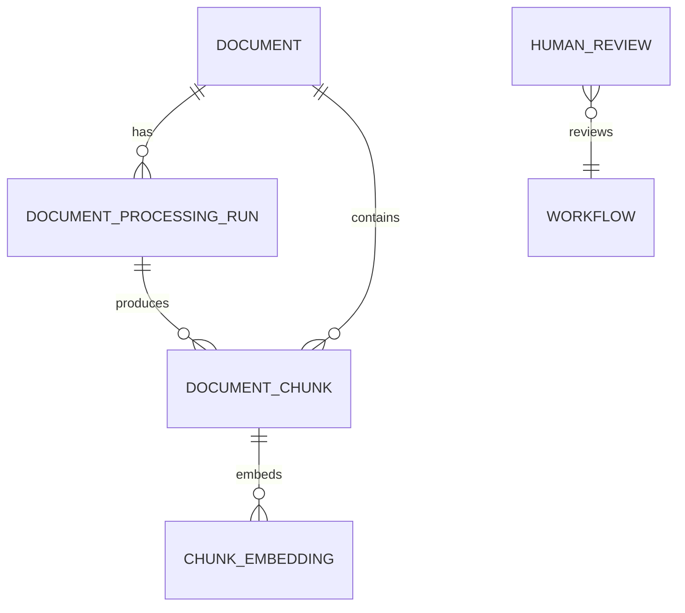

# Architecture

## Design objective

The system separates deterministic domain behavior from workflow orchestration. Ingestion, retrieval, verification, risk rules, and persistence are plain typed components. LangGraph coordinates those components and owns routing state, not their business logic.

## Data lineage

- `Document` is source identity, deduplicated by SHA-256.
- `DocumentProcessingRun` records parser, normalization, chunker, configuration, and strategy identity.
- `DocumentChunk` belongs to one processing run and retains section/source-span metadata.
- `ChunkEmbedding` is unique per chunk/provider/model combination.
- `HumanReview` snapshots the candidate and evidence used for the decision.

Processing runs are immutable experiment boundaries. A new parsing or chunking strategy creates a new run instead of rewriting prior chunks.

## Request path

1. The API validates `query`, `processing_run_id`, and `risk_tier`.
2. Vector retrieval embeds the query and searches only the selected processing run.
3. Retrieved hits become typed `EvidenceChunk` values.
4. A provider returns a Pydantic `GroundedAnswer` candidate.
5. The deterministic verifier checks citation presence, uniqueness, and membership in the evidence allow-list.
6. The risk gate produces `allow`, `abstain`, or `human_review` from explicit facts.
7. The system releases, abstains, or persists a pending review.

Provider exceptions exit as operational failures. They do not traverse the abstention branch.

## Package boundaries

| Package | Responsibility |
| --- | --- |
| `app/ingestion` | Parsing, normalization, chunking, provenance, deterministic persistence contracts |
| `app/retrieval` | Embedding abstraction, lexical/vector queries, RRF fusion |
| `app/generation` | Provider contracts, structured candidates, citation verification |
| `app/governance` | Deterministic risk decisions and review lifecycle |
| `app/agents` | Typed LangGraph state and routing |
| `app/evaluation` | Retrieval and generation measurement |
| `app/api` | HTTP transport and dependency construction |
| `app/models` | SQLAlchemy persistence models |

## Key invariants

- retrieval never crosses `processing_run_id`;
- only selected evidence is sent to a generation provider;
- normal answers require one or more citations;
- citations must reference supplied chunk IDs and may not repeat;
- an abstention has no answer text or citations and has a reason;
- candidates remain distinct from final, releasable answers;
- high-risk, otherwise-valid candidates require human review;
- a review decision is single-use and records reviewer rationale;
- routine tests never invoke paid providers.

## Provider independence

`EmbeddingProvider` and `GenerationProvider` are protocols. OpenAI and Anthropic generation adapters share the same `GroundedAnswer` output contract. The graph and governance layers contain no vendor SDK calls.

## Database lifecycle

Database engine creation is lazy. Health checks and unit tests can import the application without a local database, while production configuration rejects a missing `DATABASE_URL`. Alembic owns schema changes, including processing runs and human reviews.
